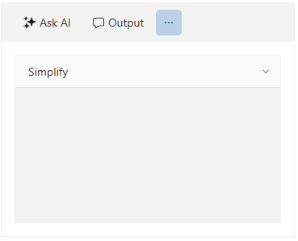

# Commands

`RadAIPrompt` provides several commands that you can utilize when working with the component. Furthermore, it allows you to define custom commands that will be displayd in a separate view to further personalize the control. 

The following list shows the commands that are exposed by the RadAIPrompt control:

* `PromptRequestCommand`&mdash;This command occurs when the input button is clicked.
* `SuggestionClickedCommand`&mdash;This command occurs when a suggestion from the Suggestions collection is clicked.
* `OutputItemCopyCommand`&mdash;This command occurs when the copy button of the generated response item is clicked.
* `OutputItemRetryCommand`&mdash;This command occurs when the retry button of the generated respone item is clicked.
* `OutputItemRatingChangedCommand`&mdash;This command occurs when the rating of the generated response is changed through the UI.

## Configuring Custom Commands

The RadAIPrompt exposes the `Commands` collection. It allows you to provide a collection of objects deriving from the`AIPromptCommandBase` class that will be displayed in the [commands view](#commands-view) of the component.

The AIPromptCommandBase class provides the following properties:

* `Icon`&mdash;Allows you to display an icon for the command in the commands view. By default, a `Uri` that points to an svg image is expected. The svg is displayed via the [RadSvgImage]() element. 
* `Text`&mdash;Allows you to specify a string that will display information about the command.

To add a logic that will be executed when the user interacts with the commands view's items, the RadAIPrompt provides two objects that extend the AIPromptCommandBase class. They are the `AIPromptCommand` and `AIPromptCommandGroup` objects.

### AIPromptCommand

This class exposes the `Command` property that will allow you to set an `ICommand` implementation to it. It will be raised when the User interacts with it. 

#### __[C#] Creating an AIPromptCommand instance__
{{region radaiprompt-commands-0}}
    public class MyViewModel
    {
        public MyViewModel()
        {
    		AIPromptCommand simplifyCommand = new AIPromptCommand()
    		{
    			Command = new DelegateCommand(OnSimplifyCommandExecuted),
    			Text = "Simplify",
    		};

    		this.MyCommands = new ObservableCollection<AIPromptCommandBase>()
    		{
                simplifyCommand
            };
        }

        public ObservableCollection<AIPromptCommandBase> MyCommands { get; set; }

        private void OnSimplifyCommandExecuted(object obj)
        {
    		MessageBox.Show("SimplifyCommand Executed");
        }
    }
{{endregion}}

#### __[XAML] Binding the custom commands collection to RadAIPrompt__
{{region radaiprompt-commands-1}}
    <Grid>
        <Grid.DataContext>
            <local:MyViewModel/>
        </Grid.DataContext>
        <telerik:RadAIPrompt x:Name="aiPrompt" Commands="{Binding MyCommands}">
            <telerik:RadAIPromptInputItem />
            <telerik:RadAIPromptOutputItem />
            <telerik:RadAIPromptCommandsItem />
        </telerik:RadAIPrompt>
    </Grid>
{{endregion}}

__RadAIPrompt with a custom commands collection__

### AIPromptCommandGroup

The `AIPromptCommandGroup` object provides the `Commands` collection property. It will allow you to group `AIPromptCommand` instances.

#### __[C#] Creating an AIPromptCommandGroup instance__
{{region radaiprompt-commands-2}}
    public class MyViewModel
    {
        public MyViewModel()
        {
    		AIPromptCommand simplifyCommand = new AIPromptCommand()
    		{
    			Command = new DelegateCommand(OnSimplifyCommandExecuted),
    			Text = "Simplify"
    		};

            AIPromptCommand extendCommand = new AIPromptCommand()
            {
                Command = new DelegateCommand(OnExtendCommandExecuted),
                Text = "Extend"
            };

    		AIPromptCommandGroup aIPromptCommandGroup = new AIPromptCommandGroup()
    		{
    			Text = "Commands group"
    		};

    		List<AIPromptCommand> commands = new List<AIPromptCommand>()
    		{
    			simplifyCommand,
    			extendCommand
    		};

    		aIPromptCommandGroup.Commands = commands;

            this.MyCommands = new ObservableCollection<AIPromptCommandBase>()
    		{
                aIPromptCommandGroup
            };
        }

        public ObservableCollection<AIPromptCommandBase> MyCommands { get; set; }

        private void OnSimplifyCommandExecuted(object obj)
        {
    		MessageBox.Show("SimplifyCommand Executed");
        }

        private void OnExtendCommandExecuted(object obj)
        {
            MessageBox.Show("ExtendCommand Executed");
        }
    }
{{endregion}}

__RadAIPrompt with grouped commands__

## See Also
* [Views]()
* [Events]()
* [RadAIPromptButon]()
* [Suggestions]()
* [Paging]()