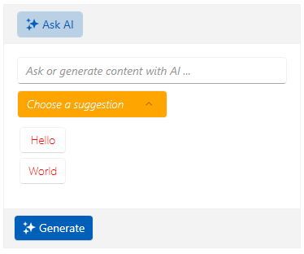

# Suggestions

The `RadAIPrompt` control allows you to define suggestions for the user prior to initiating a request. To do so, set the `AreSuggestionsVisible` property to __True__ of RadAIPrompt and add entries of the type of __string__ to its `Suggestions` collection. The Suggestions property expects a collection that implements the `IEnumerable` interface.

#### __[C#] Showing Suggestions in the RadAIPrompt__
{{region radaiprompt-suggestions-0}}
    <telerik:RadAIPrompt x:Name="aiPrompt" AreSuggestionsVisible="True">
        <telerik:RadAIPromptInputItem />
        <telerik:RadAIPrompt.Suggestions>
            <x:Array Type="sys:String"
                     xmlns:x="http://schemas.microsoft.com/winfx/2006/xaml"
                     xmlns:sys="clr-namespace:System;assembly=mscorlib">
                <sys:String>What is the weather in New York?</sys:String>
                <sys:String>What is the weather in Tokyo?</sys:String>
                <sys:String>What is the weather in Seoul?</sys:String>
                <sys:String>What is the weather in London?</sys:String>
            </x:Array>
        </telerik:RadAIPrompt.Suggestions>
    </telerik:RadAIPrompt>
{{endregion}}

__RadAIPrompt with suggestions__

## Customizing the Appearance of the Suggestions

RadAIPrompt control exposes properties that will allow you to customize the appearance of each suggestion. They are as follows:

* `SuggestionItemTemplate`&mdash;Allows you to set a custom DataTemplate that will be applied to each suggestion.
* `SuggestionHeaderContent`&mdash;Provides the functionality to specify a header for the element that displays the suggestions.
* `SuggestionHeaderContentTemplate`&mdash;Allows you to specify a custom DataTemplate for the header of the element that visualizes the suggestions.
* `SuggestionsExpanderStyle`&mdash;This property lets you set a custom Style for the RadExpander element that displays the suggestions.

The following example showscases the RadAIPrompt when the above properties are used:

#### __[C#] Defining a sample model and a view model__
{{region radaiprompt-suggestions-1}}
    public class SuggestionItem
    {
        public string SuggestionItemName { get; set; }
    }

    public class SuggestionsViewModel
    {
        public SuggestionsViewModel()
        {
    		this.SuggestionItems = new ObservableCollection<SuggestionItem>()
    		{
    			new SuggestionItem(){ SuggestionItemName = "Hello" },
    			new SuggestionItem(){ SuggestionItemName = "World" },
    		};
        }

        public ObservableCollection<SuggestionItem> SuggestionItems { get; set; }
    }
{{endregion}}

#### __[XAML] Defining the RadAIPrompt and its properties__
{{region radaiprompt-suggestions-2}}
    <Grid>
        <Grid.DataContext>
            <local:SuggestionsViewModel/>
        </Grid.DataContext>
        <telerik:RadAIPrompt x:Name="aiPrompt" 
                             Suggestions="{Binding SuggestionItems}" 
                             SuggestionsHeaderContent="Choose a suggestion" 
                             AreSuggestionsVisible="True">
            <telerik:RadAIPromptInputItem />
            <telerik:RadAIPrompt.SuggestionItemTemplate>
                <DataTemplate>
                    <telerik:RadButton Content="{Binding SuggestionItemName}"
                                       Command="{Binding SuggestionClickedCommand, RelativeSource={RelativeSource Mode=FindAncestor, AncestorType=telerik:RadAIPrompt}}"
                                       CommandParameter="{Binding SuggestionItemName}"
                                       FontWeight="Thin"
                                       Background="White"
                                       Foreground="Red"/>
                </DataTemplate>
            </telerik:RadAIPrompt.SuggestionItemTemplate>
            <telerik:RadAIPrompt.SuggestionsHeaderContentTemplate>
                <DataTemplate>
                    <TextBlock Text="{Binding}" FontWeight="Thin" FontStyle="Italic" Foreground="White"/>
                </DataTemplate>
            </telerik:RadAIPrompt.SuggestionsHeaderContentTemplate>
            <telerik:RadAIPrompt.SuggestionsExpanderStyle>
                <!-- If you use NoXaml dlls set the BasedOn property of the Style: BasedOn="{StaticResource RadExpanderStyle}" -->
                
            </telerik:RadAIPrompt.SuggestionsExpanderStyle>
        </telerik:RadAIPrompt>
    </Grid>
{{endregion}}

__RadAIPrompt suggestions with custom appearance__

## See Also
* [Views]()
* [Events]()
* [RadAIPromptButon]()
* [Commands]()
* [Paging]()