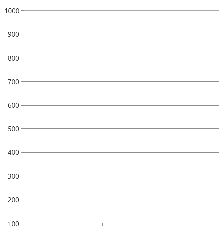
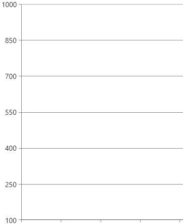
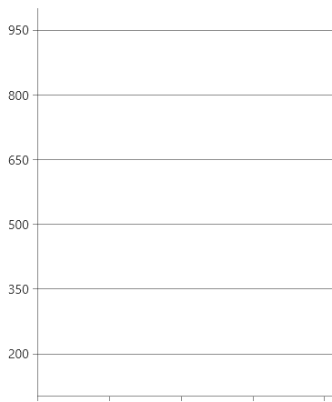
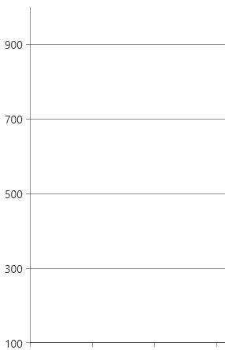

# Controlling Axis Range

The chart continuous axes have a notion of range which, by default, is calculated automatically based on the plotted data. The RadChartView axes allow to access information about the range or adjust the range manually.

Continuous axes are `LinearAxis`, `LogarithmicAxis` and `DateTimeContinuousAxis`. The `CategoricalAxis` and `DateTimeCategoricalAxis` don't have notion of range and the following information is not relevant for them.
The examples in the article work mostly with numeric values, but if you use the `DateTimeContinuousAxis` you will need to use `DateTime`.

## Actual Range

The actual range is a read-only information that tells what are the real minimum and maximum properties of the axis. This concept exists to ensure that the axis range can be accessed regardless if it is calcuilated automatically or set manually.

To get the actual range, use the `ActualRange` property of the axis.

To get the actual range when the axis is zoom-in, use the `ActualVisibleRange` property of the axis. This gives information about the currently visible minimum and maximum.

To get the actual major step, use the `ActualMajorStep` property of the axis.

#### __[C#] Getting the actual range of a LinearAxis__
{{region radchartview-axis-range-0}}
	ValueRange<double> actualRange = linearAxis.ActualRange;
	ValueRange<double> actualVisibleRange = linearAxis.ActualVisibleRange;
	double actualMajorStep = linearAxis.ActualMajorStep;
{{endregion}}

The axis also provides a couple of __events raised when the range changes__.

* `ActualRangeChanged`
* `ActualVisibleRangeChanged`
* `ActualMajorStepChanged`

#### __[C#] Actual range and step changed event handlers__
{{region radchartview-axis-range-1}}
	private void LinearAxis_ActualMajorStepChanged(object sender, EventArgs e)
	{
		var axis = (LinearAxis)sender;
		double majorStep = axis.ActualMajorStep;
	}

	private void LinearAxis_ActualVisibleRangeChanged(object sender, NumericalRangeChangedEventArgs e)
	{
		ValueRange<double> newRange = e.NewRange;
		ValueRange<double> oldRange = e.PreviousRange;
	}

	private void LinearAxis_ActualRangeChanged(object sender, NumericalRangeChangedEventArgs e)
	{
		ValueRange<double> newRange = e.NewRange;
		ValueRange<double> oldRange = e.PreviousRange;
	}
{{endregion}}

## Setting the Range Manually

The axis range can be adjusted manually by setting the `Minimum` and `Maximum` properties of the axis.

#### __[XAML] Setting axis range in XAML__
{{region radchartview-axis-range-2}}
	<telerik:LinearAxis Minimum="100" Maximum="1000" />
	
	<telerik:DateTimeContinuousAxis Minimum="05/13/2024" Maximum="06/13/2024" />	
{{endregion}}

#### __[XAML] Setting axis range in C#__
{{region radchartview-axis-range-3}}
	this.linearAxis.Minimum = 100;
	this.linearAxis.Maximum = 100;
	
	this.dateTimeContinuousAxis.Minimum = DateTime.Today;
	this.dateTimeContinuousAxis.Maximum = DateTime.Today.Months(12);	
{{endregion}}

## Setting the Step

The chart axes allow you to manually set the major and minor step, which determines the value distance between two adjacent ticks.

To set the major step, use the `MajorStep` property of the axis.

#### __[XAML] Setting major step__
{{region radchartview-axis-range-4}}
	<telerik:LinearAxis Minimum="100" MajorStep="150" Maximum="1000" />
{{endregion}}

To get the actual major step, use the `ActualMajorStep` property of the axis. This is helpful if you don't assign the `MajorStep` property and rely on the automatically calculated one.

The minor step can be set with the `MinorTicksPerMajor` property of the axis. This determines how many minor ticks should be drawn between two adjacent major ticks. Read more about this feature in the [Minor Ticks and Strips]() article.

The step in the `DateTimeContinuousAxis` works with two properties - the `MajorStep` and the `MajorStepUnit` which determines the time interval of the step. Read more in the [Date Time Axes]() article.

The first major tick can be offset by setting the `MajorTickOffset` property of the axis. This determines which tick (by index) should be shown first. For example, setting the offset to 3 will skip three ticks before start rendering the ticks.

## Setting the Tick Origin

The tick origin determines the value where the ticks originate. The positions of the ticks are determined based on the combination of the major step and tick origin values. 

To set the origin, use the `TickOrigin` property of the axis (available in `LinearAxis` and `DateTimeContinuousAxis`).

#### __[XAML] Setting major step__
{{region radchartview-axis-range-5}}
	<telerik:LinearAxis Minimum="100" TickOrigin="500" MajorStep="150" Maximum="1000" />
{{endregion}}

## Setting the Desired Ticks Count

The axis allows you to set the desired ticks count via the `DesiredTickCount` property. The axis will try to calculate a proper step based on the axis range and the desired number of ticks. Note, that the actual number of ticks may be be slightly higher or lower, since the automatic range calculation takes into account different factors and it tries to display a reasonable step between the ticks. For example, if the `DesiredTickCount` is 7, then 6 or 8 ticks may be drawn, depending on the range of the axis.

#### __[XAML] Setting desired number of ticks__
{{region radchartview-axis-range-6}}
	<telerik:LinearAxis DesiredTickCount="5" />
{{endregion}}

	
## See Also
* [Getting Started]()
* [Events]()
* [Create Data-Bound Chart]()
