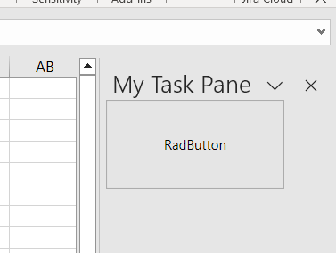
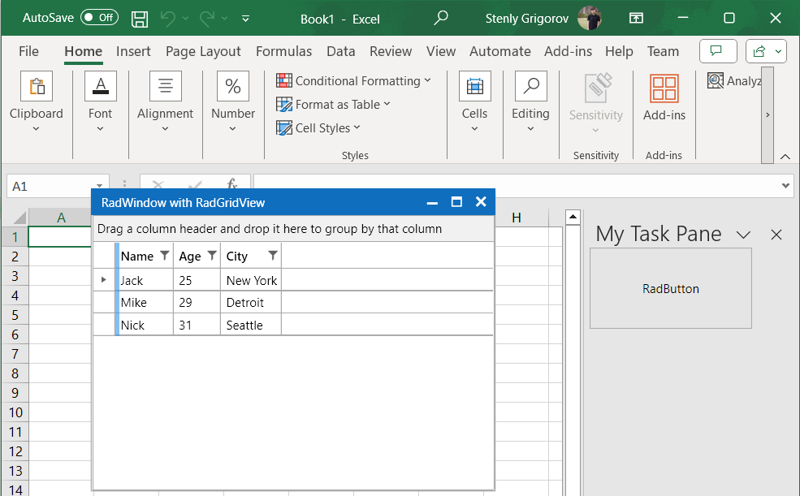

## Environment
<table>
	<tr>
		<td>Product Version</td>
		<td>2023.3.1114</td>
	</tr>
	<tr>
		<td>Product</td>
		<td>UI for WPF</td>
	</tr>
</table>

## Description

Integration of Telerik UI for WPF with Visual Studio Tools for Office (VSTO) Templates.

## Solution

To create a VSTO project, you will need to install the __Office/SharePoint Development__ package from the __Visual Studio Installer__ application.

__Office/SharePoint development package__

The following example shows how to create an Excel VSTO Add-in application and display a RadWindow and RadGridView elements. It is setup with the `NoXaml` version of the assemblies in mind.

1. Open Visual Studio and choose the __Excel VSTO Add-in__ template:

2. Create a new UserControl that will hold the Telerik UI for WPF controls.

#### __[XAML] WPF UserControl with Telerik UI for WPF components__
{{region kb-common-create-excel-addin-0}}
	<UserControl x:Class="VSTO.WPFUserControl"
	             xmlns="http://schemas.microsoft.com/winfx/2006/xaml/presentation"
	             xmlns:x="http://schemas.microsoft.com/winfx/2006/xaml"
	             xmlns:mc="http://schemas.openxmlformats.org/markup-compatibility/2006" 
	             xmlns:d="http://schemas.microsoft.com/expression/blend/2008" 
	             mc:Ignorable="d" 
	             xmlns:telerik="http://schemas.telerik.com/2008/xaml/presentation"
	             d:DesignHeight="450" d:DesignWidth="800">
	    <UserControl.Resources>
	        <ResourceDictionary>
	            <ResourceDictionary.MergedDictionaries>
	                <ResourceDictionary Source="/Telerik.Windows.Themes.Office2019;component/Themes/System.Windows.xaml"/>
	                <ResourceDictionary Source="/Telerik.Windows.Themes.Office2019;component/Themes/Telerik.Windows.Controls.xaml"/>
	            </ResourceDictionary.MergedDictionaries>
	        </ResourceDictionary>
	    </UserControl.Resources>
	    <Grid>
	        <telerik:RadButton Content="RadButton" Click="RadButton_Click"/>
	    </Grid>
	</UserControl>
{{endregion}}

The above `RadButton` will create a new `RadWindow` instance that will host a `RadGridView` control when its Click event occurs.

#### __[C#] RadButton Click event handler__
{{region kb-common-create-excel-addin-1}}
	private void RadButton_Click(object sender, RoutedEventArgs e)
	{
	    RadWindow radWindow = new RadWindow()
	    {
	        Header = "RadWindow with RadGridView",
	        WindowStartupLocation = WindowStartupLocation.CenterScreen,
	        Owner = this,
	        Width = 400,
	        Height = 300,
	    };	
	    this.SetupResources(radWindow);	
	    RadGridView radGridView = new RadGridView() { ItemsSource = this.peopleViewModel.People };
	    radWindow.Content = radGridView;	
	    radWindow.ShowDialog();
	}
{{endregion}}

The `SetupResources` method from the above code snippet merges the resource dictionaries required by the RadGridView and RadWindow controls. The example utilizes the __Office2019__ theme.

#### __[C#] SetupResources method's implementation__
{{region kb-common-create-excel-addin-2}}
	private void SetupResources(RadWindow radWindow)
	{
	    radWindow.Resources.MergedDictionaries.Clear();

	    radWindow.Resources.MergedDictionaries.Add(new ResourceDictionary()
	    {
	        Source = new Uri("/Telerik.Windows.Themes.Office2019;component/Themes/System.Windows.xaml", UriKind.RelativeOrAbsolute)
	    });
	    radWindow.Resources.MergedDictionaries.Add(new ResourceDictionary()
	    {
	        Source = new Uri("/Telerik.Windows.Themes.Office2019;component/Themes/Telerik.Windows.Controls.xaml", UriKind.RelativeOrAbsolute)
	    });
	    radWindow.Resources.MergedDictionaries.Add(new ResourceDictionary()
	    {
	        Source = new Uri("/Telerik.Windows.Themes.Office2019;component/Themes/Telerik.Windows.Controls.GridView.xaml", UriKind.RelativeOrAbsolute)
	    });
	    radWindow.Resources.MergedDictionaries.Add(new ResourceDictionary()
	    {
	        Source = new Uri("/Telerik.Windows.Themes.Office2019;component/Themes/Telerik.Windows.Controls.Input.xaml", UriKind.RelativeOrAbsolute)
	    });
	    radWindow.Resources.MergedDictionaries.Add(new ResourceDictionary()
	    {
	        Source = new Uri("/Telerik.Windows.Themes.Office2019;component/Themes/Telerik.Windows.Controls.Navigation.xaml", UriKind.RelativeOrAbsolute)
	    });
	}
{{endregion}}

3. Create a __WindowsForms UserControl__ that will hold the WPF UserControl in its `Child` property.

#### __[C#] WindowsForms UserControl__
{{region kb-common-create-excel-addin-3}}
	public partial class WinFormsUserControl : UserControl
	{
	    private ElementHost ctrlHost;

	    public WinFormsUserControl()
	    {
	        InitializeComponent();

	        ctrlHost = new ElementHost();
	        ctrlHost.Child = new WPFUserControl();
	        this.Controls.Add(ctrlHost);
	    }
	}
{{endregion}}

4. Open the add-in class generated by the __Excel VSTO Add-in__ template and create new `CustomTaskPane` instance in the event handler for the `Startup` event. This CustomTaskPane will hold the WindowsForms UserControl.

#### __[C#] AddIn class implementation__
{{region kb-common-create-excel-addin-4}}
	public partial class MyAddIn
	{
	    private Microsoft.Office.Tools.CustomTaskPane myCustomTaskPane;
	    private WinFormsUserControl userControl;

	    private void OnMyAddInStartup(object sender, System.EventArgs e)
	    {
	        userControl = new WinFormsUserControl();

	        myCustomTaskPane = this.CustomTaskPanes.Add(userControl, "My Task Pane");
	        myCustomTaskPane.Visible = true;
	    }

	    private void OnMyAddInShutdown(object sender, System.EventArgs e)
	    {
	    }

	    #region VSTO generated code

	    /// 

	    /// Required method for Designer support - do not modify
	    /// the contents of this method with the code editor.
	    /// 

	    private void InternalStartup()
	    {
	        this.Startup += new System.EventHandler(OnMyAddInStartup);
	        this.Shutdown += new System.EventHandler(OnMyAddInShutdown);
	    }
	
	    #endregion
	}
{{endregion}}

__Excel VSTO Add-in with a WinForms UserControl that hosts the WPFUserControl__

__Excel VSTO Add-in with Telerik UI for WPF components__

