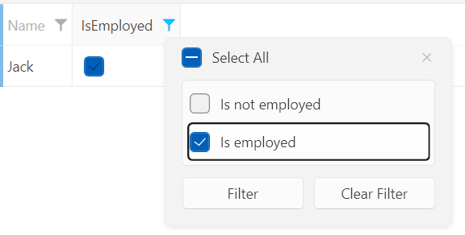

## Environment
<table>
	<tr>
		<td>Product Version</td>
		<td>2023.3.1114</td>
	</tr>
	<tr>
		<td>Product</td>
		<td>RadGridView for WPF</td>
	</tr>
</table>

## Description

How to customize the distinct values of a column of `RadGridView` when filtering.

## Solution

The `GridViewBoundColumnBase` class exposes the `FilteringDisplayFunc` property, which will allow you to customize the distinct values when filtering. To achieve this, extend the column that you will use and create a custom function of the type of `Func<object, object>`. This custom function will be returned when the FilteringDisplayFunc property of this column is called.

The following example shows how to utilize the FilteringDisplayFunc property. It extends the `GridViewDataColumn` column, but you can use the same approach with the other types of columns:

1. Create the model and view model:

#### __[C#] Creating a sample model and view model__
{{region kb-gridview-filteringdisplayfunc-0}}
    public class Person
    {
        public string Name { get; set; }
        public bool IsEmployed { get; set; }
    }

    public class MainViewModel
    {
        public MainViewModel()
        {
            this.People = new ObservableCollection<Person>()
            {
                new Person() { Name = "Jack", IsEmployed = true },
                new Person() { Name = "Mike", IsEmployed = false },
            };
        }

        public ObservableCollection<Person> People { get; set; }
    }
{{endregion}}

2. Extend the column that you will use override the FilteringDisplayFunc property:

#### __[C#] Creating a custom column and overriding the FilteringDisplayFunc property__
{{region kb-gridview-filteringdisplayfunc-1}}
    public class CustomGridViewDataColumn : GridViewDataColumn
    {
        protected override Func<object, object> FilteringDisplayFunc => base.FilteringDisplayFunc;
    }
{{endregion}}

3. Create a field of the type of `Func<object, object>` and a method that will contain the distinct values modification. After that, set it as a return value for the FilteringDisplayFunc property:

#### __[C#] Creating a custom function__
{{region kb-gridview-filteringdisplayfunc-2}}
    public class CustomGridViewDataColumn : GridViewDataColumn
    {
        private Func<object, object> filteringDisplayFunc;

        public CustomGridViewDataColumn()
        {
            this.filteringDisplayFunc = GetDistinctValueDisplayObject;
        }

        private object GetDistinctValueDisplayObject(object arg)
        {
            return null;
        }

        protected override Func<object, object> FilteringDisplayFunc
        {
            get { return filteringDisplayFunc; }
        }
    }
{{endregion}}

4. The logic of the custom column will modify the distinct values for the IsEmployed property from the first step. 

#### __[C#] Implementing the customization logic for the distinct values of the custom column__
{{region kb-gridview-filteringdisplayfunc-3}}
    public class CustomGridViewDataColumn : GridViewDataColumn
    {
        private Func<object, object> filteringDisplayFunc;

        public CustomGridViewDataColumn()
        {
            this.filteringDisplayFunc = GetDistinctValueDisplayObject;
        }

        private object GetDistinctValueDisplayObject(object arg)
        {
            if (arg is bool isEmployed)
            {
                string displayNameValue = isEmployed ? "Is employed" : "Is not employed";

                return displayNameValue;
            }

            return null;
        }

        protected override Func<object, object> FilteringDisplayFunc
        {
            get { return filteringDisplayFunc; }
        }
    }
{{endregion}}

5. Add the custom column to the Columns collection of RadGridView and bind it to the intended property. For this example, it will be the IsEmployed property:

#### __[C#] Adding the custom column to the Columns collection of RadGridView__
{{region kb-gridview-filteringdisplayfunc-4}}
    <Grid>
        <Grid.DataContext>
            <local:MainViewModel/>
        </Grid.DataContext>
        <telerik:RadGridView ItemsSource="{Binding People}" AutoGenerateColumns="False">
            <telerik:RadGridView.Columns>
                <telerik:GridViewDataColumn DataMemberBinding="{Binding Name}"/>
                <local:CustomGridViewDataColumn DataMemberBinding="{Binding IsEmployed}"/>
            </telerik:RadGridView.Columns>
        </telerik:RadGridView>
    </Grid>
{{endregion}}

The produced result will be as follows:

