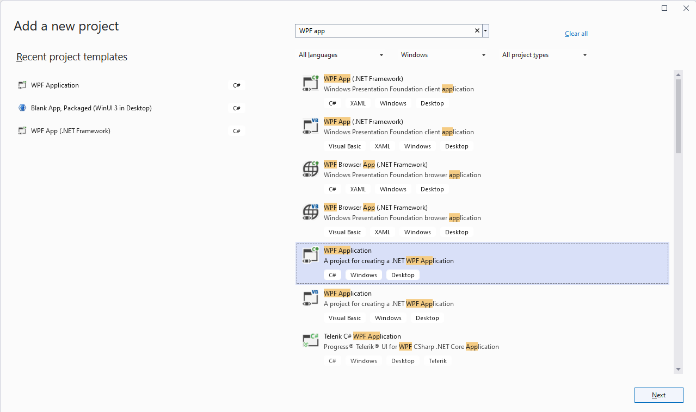

# Migrating to .NET

This article shows how to migrate from an existing WPF .NET Framework project to a .NET one (.NET 6, .NET 7 or .NET 8).

1. Create a new __.NET__ application using Visual Studio. 
	
	#### Figure 1: Creating new project
		
	
	>tip You can also use the Telerik Visual Studio Extensions to create a new project. Read more about this in the [Integration]() section of the documentation.
	
2. Add the existing files from the original project as linked files to the .NET project.
	
	#### Figure 2: Linking files from the original project
	
	
	
 
3. Reference the Telerik assemblies built against .NET.
	
	If Telerik UI for WPF is installed on the machine, you can find the dlls in the "*UI for WPF installation folder\Binaries\NET+version number*" folder. Otherwise, [download the .zip file]() with the dlls or install them via the [NuGet package manager]().
	
	#### Figure 3: Checking if a Telerik assembly is built against .NET  
	

4. Several controls rely on third party NuGet packages. These are automatically installed when adding the Telerik assemblies via NuGet or the Telerik Visual Studio Extension. In case you reference the assemblies manually, one or more of the following packages should be installed manually: `System.Data.OleDb`, `System.Drawing.Common` and `System.ServiceModel.Http`.

## Tips

* If your project has images with [__Build Action__](https://docs.microsoft.com/en-us/visualstudio/ide/build-actions?view=vs-2019) set to Resource, change it to Embeded Resource or Content.

* If you use the __AssemblyInfo__ or __App.manifest__ files from your original project, add them manually in the .NET Core project. The new project template uses a different approach and generates the same assembly attributes as part of the build process.
	
	#### __[XML] Example 1: GenerateAssemblyInfo attribute__
	{{region netcore-support-migration-0}}
		<generateassemblyinfo>false</generateassemblyinfo>
	{{endregion}}

* The getting started experience in RadRichTextBox for .NET Core has been improved compared to its .NET Framework alternative. Check the [.NET Core Support]() help topic for more details on the changes you might encounter.

## See Also

* [Deploy WPF .NET Core Application]()
* [Using RadRichTextBox in .NET Core]()
