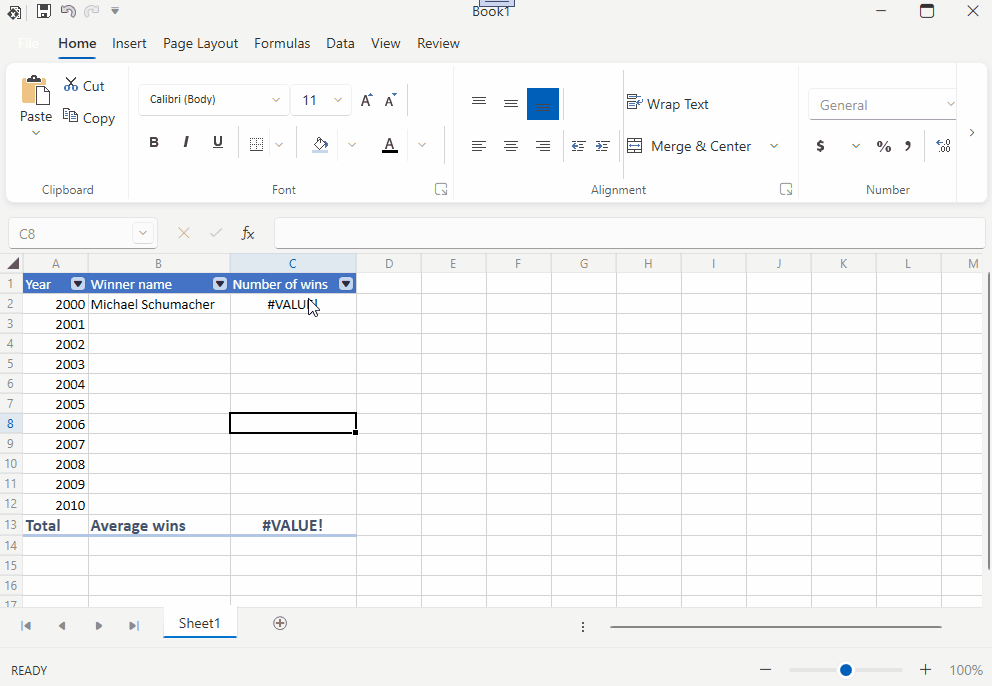

# Smart AI Components

Telerik Smart (AI) Components is a set of integration examples that show how to use the Telerik UI for WPF controls in AI-based scenario. Therefore, making it easy to add AI-powered features to your .NET applications without extra effort. Smart(AI) Components are currently in an experimental phase.

The projects showing the smart components can be found at [https://github.com/telerik/telerik-smartai-components/tree/master](https://github.com/telerik/telerik-smartai-components/tree/master).

To run the examples, you should first [aquire key credentials](https://learn.microsoft.com/en-us/azure/ai-services/openai/reference#authentication) required to access the end point of the [Azure OpenAI services](https://learn.microsoft.com/en-us/azure/ai-services/openai/reference).

## Smart RichTextBox

This example shows how to integrate the Azure OpenAI services with __RadRichTextBox for WPF__. Typing in the document will trigger a call to the OpenAI services and append the returned result into the document.

## Smart Spreadsheet

This example shows how to integrate the Azure OpenAI services with __RadSpreadsheet for WPF__. In the example, you can use the custom `AIFunction` to get the result of the cells automatically.

## See Also  
* [Telerik UI for WPF Getting Started]()
